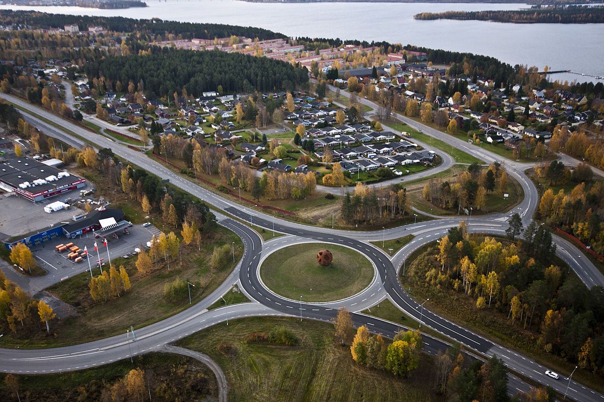
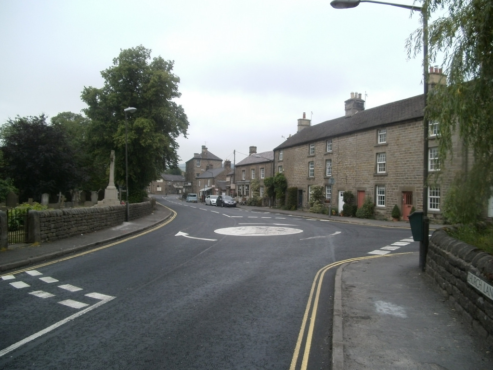

A **roundabout** is a type of circular junction where multiple roads meet and are directed around an island at the center of the junction in a one-way traffic flow.

Aerial view of [Notviken in Luleå](https://sv.wikipedia.org/wiki/Notviken). Wikipedia

> Studies by the Federal Highway Administration have found that roundabouts can increase traffic capacity by 30 percent to 50 percent compared to traditional intersections.

  \*&nbsp;<https://www.wsdot.wa.gov/Safety/roundabouts/BasicFacts.htm>

## Roundabout types

### Mini-roundabout

**Mini-roundabout**,  in addition to being smaller than typical roundabouts, have a _right of way_ and a _[traversable](https://wiki.openstreetmap.org/wiki/Traversable)_ center island. They are also often replaced by stop signs at four-way intersections to slow traffic speeds and reduce accidents in residential neighborhoods that are not designed to accommodate larger vehicles. Vehicles are required to treat the center island as if it were a solid island and drive around it.

_A view of a mini-roundabout from Church Lane with School Lane to the right and Church Street (A 623) to the left with a partial view of Saint Annes Church (Church of England) and War Memorial in the village of Baslow in Derbyshire. Photo Taken: 10/07/13_

_by [Eamon Curry](https://www.flickr.com/photos/eamoncurry/) - <https://flic.kr/p/fpUthJ>_

**Mini-roundabouts** center islands can be a painted circle or a low dome but **must be fully traversable** by vehicles. Mini-roundabouts are sometimes grouped in pairs (a double mini-roundabout) or in "chains", simplifying navigation of otherwise awkward junctions.

_**Double mini-roundabout, Lammy, Omagh**_

_Pictured along Brookmount Road. It is intersected by Tamlaght Road_

_© Copyright [Kenneth Allen](http://www.geograph.ie/profile/2282) and licensed for [reuse](http://www.geograph.ie/reuse.php?id=3062935) under this [Creative Commons Licence](http://creativecommons.org/licenses/by-sa/2.0/)._

> In the UK – and also in other highway jurisdictions – the maximum size for a mini-roundabout is 28 metre ICD (inscribed circle diameter).

**How to map**

[![][72941a36]][72941a36]

_Mini-roundabout in OSM_

  [72941a36]: ../../images/intersection-modeling/roundabouts/roundabout_mapping_mini_roundabout.png "how to map mini-roundabout"

Select the node on way crossing and add tags **[highway][1108080d]**=**[mini_roundabout][11be223c]**. Please note, that the key **[direction](https://wiki.openstreetmap.org/wiki/Key:direction)**=**\*** only needs to be specified if the traffic flow on the mini-roundabout is clockwise 🔁 as the default value for this key in conjunction with mini-roundabouts is counter-clockwise 🔄.

As the wiki suggests, we mark mini-roundabouts at the place of the traversable center point. In the case of roundabouts with a traffic island in the center of the roundabout, if there is a sign _roundabout_, tag it with **junction**=**roundabout** + **traffic_calming**=**island** tags on the node of the intersection, otherwise put only **traffic_calming**=**island** tag.

![][7c512a18]

_Small roundabout with traffic island by **[Elaine Nelson](https://www.flickr.com/photos/epersonae/)** - <https://flic.kr/p/8n4kXv>_

  [7c512a18]: ../../images/intersection-modeling/roundabouts/roundabout_small.jpg "small roundabout"

Mini-roundabout always need to be represented by **node**. Another way is to draw the roundabout as circular line in the direction the traffic flows and tag it as  **highway=residential\|unclassified** + **oneway**=**yes** and **junction**=**roundabout**.

**Common Misconceptions**

What is not a mini-roundabout?

-   Traffic calming island in the center of a junction - **[traffic_calming](https://wiki.openstreetmap.org/wiki/Key:traffic_calming)**=**[island](https://wiki.openstreetmap.org/wiki/Tag:traffic_calming%3Disland)**
-   Turning circle - this is a circular feature with a traversable center point, which allows vehicles to turn around -  **[highway][1108080d]**=**[turning_circle][496a5a09]**
-   Turning loop has the same function as the turning circle but with non-traversable center point -  **[highway][1108080d]**=**[turning_loop][e1236adf]**
-   Smaller roundabout, but not a mini-roundabout. Treat it the same as a large roundabout, and for consistency put  **[junction][f14df547]**=**[roundabout][bca8053e]** tag on the node of the junction.

[1108080d]: https://wiki.openstreetmap.org/wiki/Key:highway

[e1236adf]: https://wiki.openstreetmap.org/wiki/Tag:highway%3Dturning_loop

[496a5a09]: https://wiki.openstreetmap.org/wiki/Tag:highway%3Dturning_circle

[bca8053e]: https://wiki.openstreetmap.org/wiki/Tag:junction%3Droundabout

[f14df547]: https://wiki.openstreetmap.org/wiki/Key:junction

See examples of mini-roundabouts in the [OpenStreetMap Wiki](https://wiki.openstreetmap.org/wiki/Tag:highway%3Dmini_roundabout#Mini-roundabouts).

### Roundabout

A [roundabout](https://en.wikipedia.org/wiki/Roundabout) is a generally circular road [junction](https://wiki.openstreetmap.org/wiki/Junctions) where the traffic on the roundabout has right of way.   They are tagged with **[junction][f14df547]**=**[roundabout](https://wiki.openstreetmap.org/wiki/Tag:junction%3Droundabout)** tag. This tag is used only on road intersections where traffic on the roundabout has right of way in the absence of a traffic signal.

[![roundabout][108eb915]][108eb915]
_Take a look at a [wireframe view][c134f465] of this roundabout to get some details from the imagery_

  [108eb915]: ../../images/intersection-modeling/roundabouts/roundabout.png "roundabout"
  [c134f465]: ../../images/intersection-modeling/roundabouts/roundabout_wireframe.png "wireframe view"

**How to map**

To indicate a roundabout — draw a closed line in the direction the traffic flows, the same as you do it during the road tracing and tag it with the **[junction][f14df547]**=**[roundabout](https://wiki.openstreetmap.org/wiki/Tag:junction%3Droundabout)** tag and appropriate **highway**=**\*** tag value.

Roundabouts are implied one-way roads, but you may specify this explicitly by adding **[oneway](https://wiki.openstreetmap.org/wiki/Key:oneway)**=**[yes](https://wiki.openstreetmap.org/wiki/Tag:oneway%3Dyes)** tag. Additionally the number of **[lanes](https://wiki.openstreetmap.org/wiki/Key:lanes)**=**\*** in the circle (typically 2, where long vehicles will need to use both) can also be tagged.

Connect road lines from which the traffic flows to the roundabout. If a dual carriageway shares traffic with the roundabout, connect each its direction (one approaching, one departing) separately to the respective exit and entrance nodes on the roundabout. Don’t use the same node as entrance to and exit from a roundabout. Each road has to be connected with the roundabout in a separate node.

When two roads share the same exit/entrance node connect them before the roundabout.

[![][8c17feb2]][8c17feb2]

  [8c17feb2]: ../../images/intersection-modeling/roundabouts/roundabout_pinch_ways.png

**Roundabout shapes**

Roundabouts are not necessarily circular in shape: there are roundabouts that are 0-shaped (oval) or D-shaped (with a straight segment, notably those created on a square whose one side is along an avenue).

[![][c4d4f134]][c4d4f134]

  [c4d4f134]: ../../images/intersection-modeling/roundabouts/roundabout_o_shape.png "O-shaped roundabout"

See examples of roundabouts in the [OpenStreetMap Wiki](https://wiki.openstreetmap.org/wiki/Tag:junction%3Droundabout#Roundabouts).

### Traffic circle

A **traffic circle** is a type of intersection that directs both turning and through traffic onto a [one-way circular roadway](https://www.openstreetmap.org/user/daniel-j-h/diary/40101). Contrary to a roundabout, where entering traffic always yields to traffic already in the circle and merges in directly, the entrances to traffic circles are three-way intersections often controlled either by stop signs or traffic signals, though not in all cases.

![][bceeea1b]

  [bceeea1b]: ../../images/intersection-modeling/roundabouts/roundabout_traffic_circle.png "Traffic circle"

The size of circular junctions and rotaries can vary from small to very large with several lanes, however generally **<u>the rotary or circular junction should not have any road network inside itself</u>**, this means circular ring roads around a city are not valid circular junctions.

To designate such case of circular junction use tag **[junction][f14df547]**=**[circular][d11d94d4]**.

  [d11d94d4]: https://wiki.openstreetmap.org/wiki/Tag:junction%3Dcircular

**How to map**

To add such a junction, use the same approach as for [drawing roundabouts](#how-to-map-roundabout). Draw a circle line and tag it accordingly to the class of the roads that join it. Mark the appropriate nodes with traffic lights and traffic signs that control the priority of the movement of traffic flows.

If a traffic circle or roundabout is bisected by further roads that use different parts of the circle, you may split the closed line into segments with similar tagging and add each segment into respective route relation.

[![][8d6d5862]][8d6d5862]
_Place Charles de Gaulle is a large road junction in Paris, France, the meeting point of twelve straight avenues_

  [8d6d5862]: ../../images/intersection-modeling/roundabouts/roundabout_traffic_circle_paris.png "Place Charles de Gaulle is a large road junction in Paris, France, the meeting point of twelve straight avenues"

## Other features that similar to a roundabout but are not so

### Hamburger roundabout/throughabout/cut-through

In spite of their name, [Hamburger roundabouts](https://wiki.openstreetmap.org/wiki/Hamburger_roundabout), also known as [throughabout or cut-through](http://en.wikipedia.org/wiki/Roundabout#Hamburger_roundabout), are not roundabouts. In this situation the tag **[junction][f14df547]**=**[roundabout](https://wiki.openstreetmap.org/wiki/Tag:junction%3Droundabout)** has to be avoided.

|[![][2ff2d8eb]][2ff2d8eb]|[![][b421c5e4]][b421c5e4]|
|---|---|
|_A throughabout divided by double carriageway_|_A throughabout divided by bi-directional way_|

  [2ff2d8eb]: ../../images/intersection-modeling/roundabouts/roundabout_throughabout_kyiv.png
  [b421c5e4]: ../../images/intersection-modeling/roundabouts/roundabout_throughabout.png

### Turning circle

Turning circle - this is a circular feature with a traversable center point, which allows vehicles to turn around - **[highway][1108080d]**=**[turning_circle][496a5a09]**

[![][86003e49]][86003e49]

  [86003e49]: ../../images/intersection-modeling/roundabouts/roundabout_turning_circle.png

### Turning loop

Turning loop is similar to the turning circle but with a non-traversable center point.

_Turning loop by [Tony Webster](https://www.flickr.com/photos/diversey/), <https://flic.kr/p/4aZCFB>_

**[highway][1108080d]**=**[turning_loop][e1236adf]** is used on a node to indicate a widened area of a highway with a non-traversable island for turning around, often circular and at the end of a road.

|[![][aaf28646]][aaf28646]|[![][41dbfb48]][41dbfb48]|
|---|---|
|_node with **highway**=**turning_loop** tag_|_circular way with **highway**=**residential**_|

  [41dbfb48]: ../../images/intersection-modeling/roundabouts/roundabout_turning_loop_circle.png

  [aaf28646]: ../../images/intersection-modeling/roundabouts/roundabout_turning_loop_node.png

### "Magic" roundabouts/ring junctions

"Magic roundabouts" direct traffic in both directions around the central island. In order to connect the inner and outer ring with the adjacent roads, small roundabouts or mini-roundabouts are used. Drivers on small roundabouts or mini-roundabouts have the right of way, unlike those who are on the inner or outer ring of the magic roundabout. Each nodal element of such a structure, represented by roundabouts, can be considered as an independent intersection that is connected to the rest of the intersections (roundabouts) via linker roads.

|[![][834623ed]][834623ed]|[![][bbc5e25f]][bbc5e25f]|
|---|---|
|_The [Swindon Magic Roundabout](https://en.wikipedia.org/wiki/Magic&#95;Roundabout&#95;&#40;Swindon&#41;)_|_The **Greenstead roundabout** in [Colchester, Essex](https://en.wikipedia.org/wiki/Colchester)._|

[![][8c1b9238]][8c1b9238]
_[Denham Roundabout](https://en.wikipedia.org/wiki/Denham_Roundabout)_

  [834623ed]: ../../images/intersection-modeling/roundabouts/roundabout_magic_swindon.png
  [bbc5e25f]: ../../images/intersection-modeling/roundabouts/roundabout_magic__colchester.png

  [8c1b9238]: ../../images/intersection-modeling/roundabouts/roundabout_magic_swindon_denham.png

## See also

-   [Wikipedia article about roundabouts](http://en.wikipedia.org/wiki/Roundabout)
-   [UK Highways Agency Design Manual for Roads and Bridges](http://www.standardsforhighways.co.uk/dmrb/vol6/section2/td1607.pdf) - Volume 6, Section 2, Part 3: Geometric Design of Roundabouts
-   [US Federal Highway Administration Safety Program - Technical Summary](http://safety.fhwa.dot.gov/intersection/roundabouts/fhwasa10006/) - Roundabouts
-   Wiki OpenStreetMap
    -   Mini-roundabouts (**[highway][1108080d]**=**[mini_roundabout][11be223c]**)
    -   Roundabouts (**[junction][f14df547]**=**[roundabout][bca8053e]**)
    -   Rotaries and traffic-circles (**[junction][f14df547]**=**[circular][d11d94d4]**)
    -   Turning circles (**[highway][1108080d]**=**[turning_circle][496a5a09]**)
    -   Turning loops (**[highway][1108080d]**=**[turning_loop][e1236adf]**)

[11be223c]: https://wiki.openstreetmap.org/wiki/Tag:highway%3Dmini_roundabout
